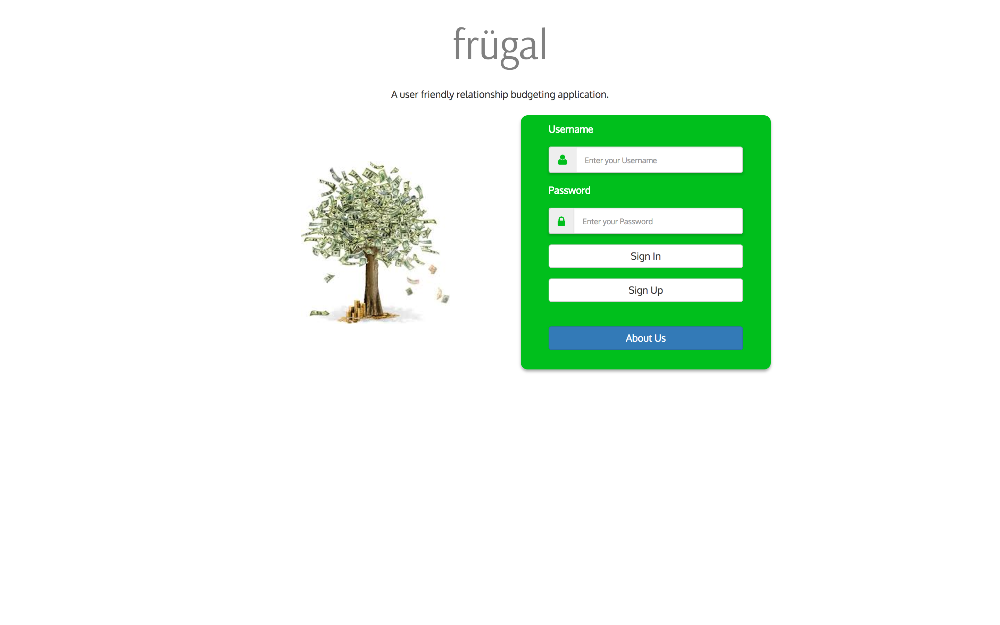
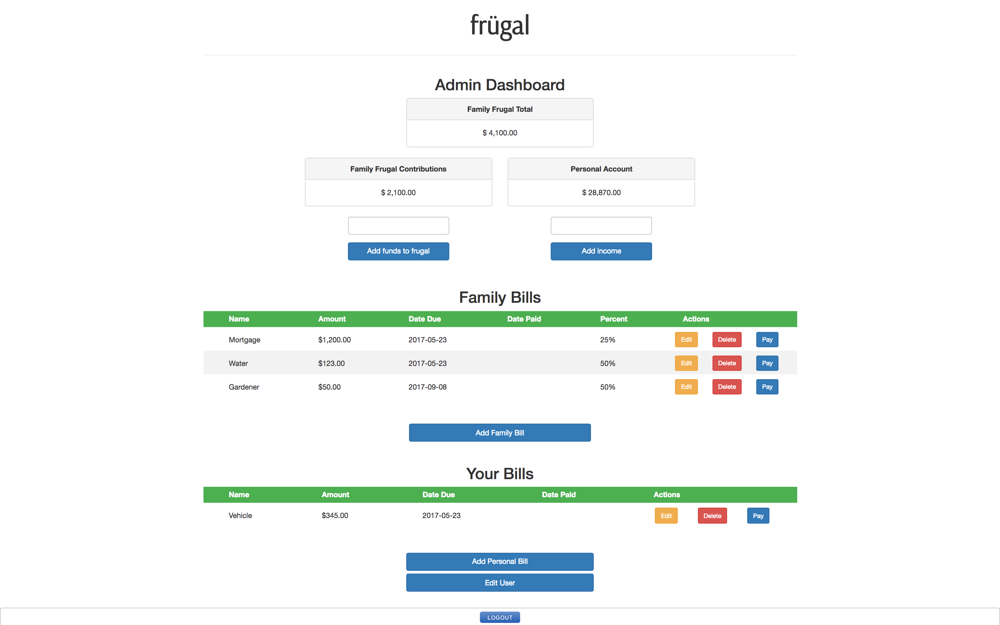
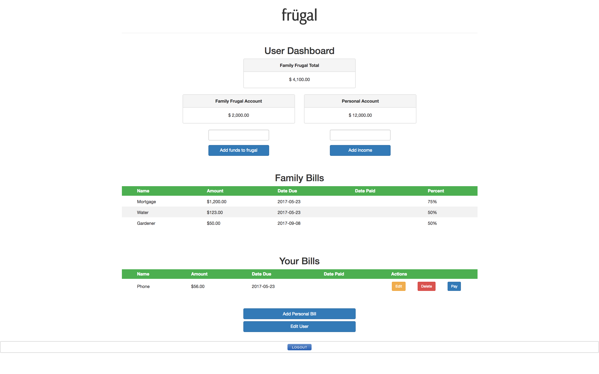

# Frugal

## Application URL
<a href="http://gregengler.com:8080/MVCMidtermProject/">**Click Here**</a>

Username = JohnWaldorf 
Password = password

### Who did the project?
This Create, Read, Update, Destroy (CRUD) project was designed, created, and coded by David Burnett, Greg Engler, Seth Thomas, and Will Roberts. The goal was to implement Gradle with the Spring tools IO IDE in order to develop a unique web application. This project not only illustrates all of our abilities to collaborate through communication and GitHub, but also competently design and build a full stack web application.

### What was the project?
The goal was to implement C.R.U.D. (Create, Read, Update, Delete), which is one of the most common types of behavior on the web. It represents the states of persistence that almost every web application has. The name of the web application was carefully named Frugal.

The purpose of the application was to allow two people to manage their bills as well as allocate funds to a shared "frugal" account using their own bank accounts.  The administrator is able to add shared bills as well as edit and delete those bills.

<h2>Landing Page</h2>

<h2>Admin Dashboard</h2>

<h2>User Dashboard</h2>

### Technologies used:
* Spring MVC (model-view-controller)
* Spring STS (Spring Tool Suite)
* JPA (Java Persistence API)
* Gradle Managed Dependencies
* MySQL and MySQL Workbench
* Java Server Pages and JSTL/EL
* HTML/CSS/Bootstrap
* MySQL and MySQL Workbench

Some of the technologies used in this project were session attributes, @Autowired annotations, as well as learning the latest capabilities of the Spring IO IDE. The team also utilized JPA and MVC, associating both with Gradle natures. Another key component of the project was learning about new dependencies in our persistence XML’s to pull in EntityManagers.

### Future features we would like to add:
* For families, adding the ability to add a child as a user and listing his or her chores
* Calendar dropdown for the dates
* Make bill responsibility percentage functional, allowing admins to assign a percentage of a family bill to a user
* Form validation
